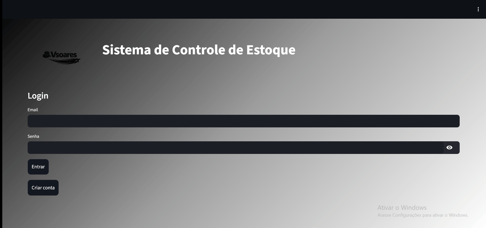
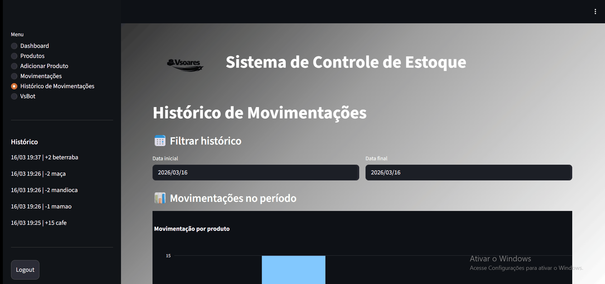
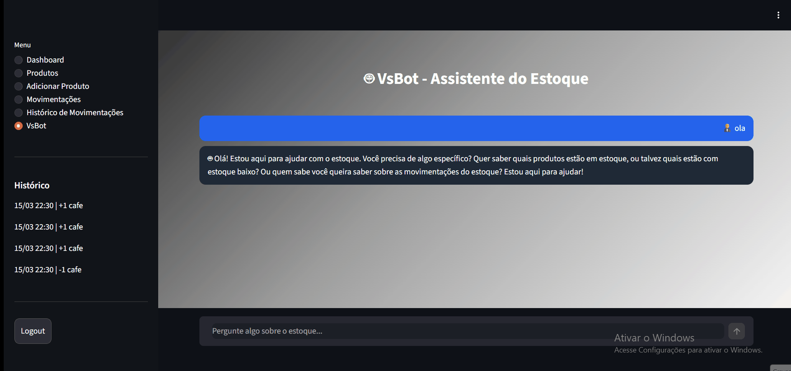

# 📦 VSestoque


Complete inventory management system with user authentication, interactive dashboard, and chatbot automation.

The project demonstrates the development of a modern application using:

API REST

Decoupled frontend

Process automation

Cloud deployment

---

# 🌐 Access the Application

### Frontend

https://estoque-frontend-yi4t.onrender.com

### Backend

https://estoque-backend-pyq6.onrender.com

### Automation (n8n)

https://n8n-ldgy.onrender.com

---

# 🎥 Demo

### 🔐 Login and Registration



---

### 📊 Dashboard


---

### 📦 Product Management


---

### ➕ Add Product


---

### 🔄 Stock Movements


---

### 📜 Movement History



---

### 🤖 VsBot (chatbot)



---

# ✔️ Features

User registration

Login with JWT authentication

Complete product management

Stock input and output

Movement history

Dashboard with interactive charts

Chatbot integration

Automation using n8n

REST API with FastAPI

Modern interface with Streamlit

Automatic low stock notification

---

# 🛠️ Technologies Used

## Backend

Python

FastAPI

SQLAlchemy

JWT Authentication

## Frontend

Streamlit

Plotly

## Database

PostgreSQL

## Automation

n8n

## Infrastructure

Docker

Render

---

# 🏗️ System Architecture

Modular architecture based on decoupled services.

```
User
   ↓
Frontend (Streamlit)
   ↓
Backend API (FastAPI)
   ↓
Database (PostgreSQL)
   ↓
Automation (n8n)
   ↓
Chatbot (VsBot)
```

---

# 💻 How to Run the Project Locally

## 1️⃣ Clone the repository

```
git clone https://github.com/valdsoares360-gif/controle-estoque.git
```

## 2️⃣ Enter the project folder

```
cd controle-estoque
```

## 3️⃣ Create virtual environment

```
python -m venv venv
```

## 4️⃣ Activate virtual environment

Windows

```
venv\Scripts\activate
```

## 5️⃣ Install dependencies

```
pip install -r requirements.txt
```

## 6️⃣ Run Backend

```
uvicorn app.main:app --reload
```

Backend available at:

```
http://localhost:8000
```

## 7️⃣ Run Frontend

```
streamlit run frontend/app.py
```

Frontend available at:

```
http://localhost:8501
```

---

# 🤖 n8n Integration

The project uses n8n for process automation and chatbot integration.

Workflow:

Application → Webhook → n8n → Automation → Response to the user

This allows creating integrations and automations based on system events.

---

# 📚 Learnings

During the development of this project, several important concepts were applied, such as:

REST API development

JWT authentication

Decoupled architecture

Service integration

Database manipulation

Automation with n8n

Cloud deployment

---

# 🚀 Possible Future Improvements

User permission system

Report export

Advanced dashboard

Integration with external APIs

---

# 👨‍💻 Author

Valdinei Santos Soares

GitHub

https://github.com/valdsoares360-gif
